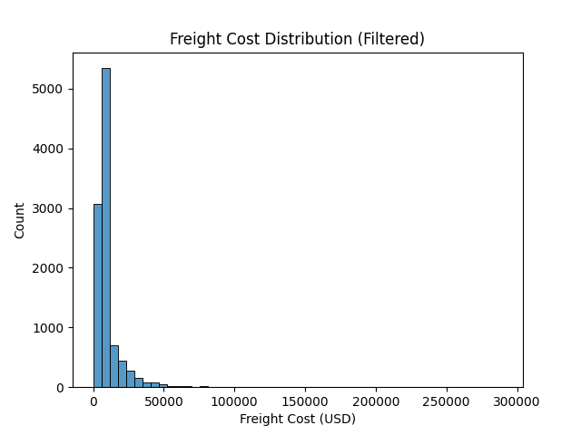
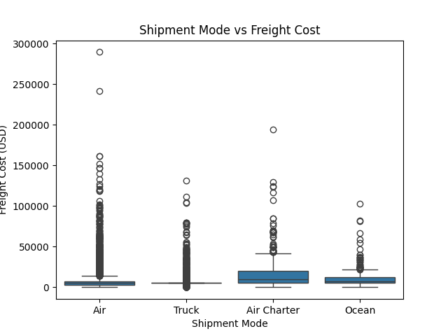
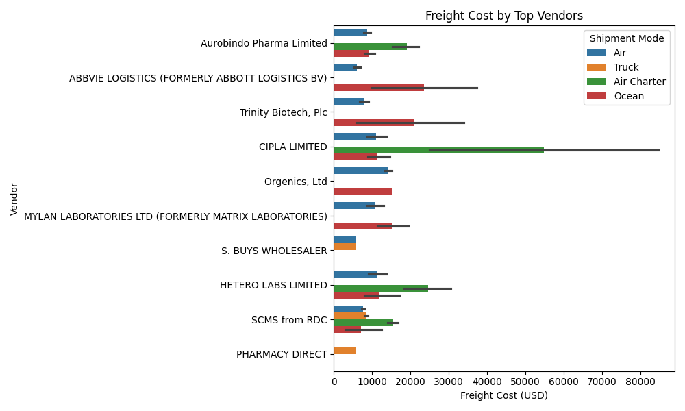

# 📦 Supply Chain Logistics EDA

## 🚀 Problem Statement

Freight costs in supply chain operations vary significantly due to vendor selection, shipment mode, and operational inefficiencies. This project analyzes shipment data to identify key cost drivers and optimization opportunities.

---

## 📊 Dataset

* 10,000+ shipment records
* Includes vendor, shipment mode, freight cost, product details, and delivery timelines

---

## 📊 Key Metrics
- Total Records: 10,000+  
- Key Variable: Freight Cost (USD)  
- Main Drivers: Shipment Mode, Vendor

---

## 🧹 Data Cleaning

* Converted incorrect data types (Freight Cost, Weight)
* Handled missing values using median & mode
* Removed duplicate records

---

## 📈 Key Insights

* Freight cost distribution is highly skewed with significant outliers
* Shipment mode is the primary cost driver (Air > Ocean > Truck)
* Certain vendors consistently incur higher costs
* High variability indicates inefficiencies in logistics operations

---

## 📸 Visualizations

### Freight Cost Distribution
Shows right-skewed distribution with high-cost outliers.

---

### Shipment Mode vs Cost
Highlights cost differences across transportation modes.

---

### Vendor Analysis
Compares average freight cost across top vendors.

---

## 💡 Business Recommendations

* Reduce dependency on high-cost shipment modes
* Optimize vendor selection based on cost efficiency
* Investigate outlier shipments
* Improve data quality for better decision-making

---

## 🛠️ Tech Stack

Python, Pandas, NumPy, Seaborn, Matplotlib

---

## 📌 Conclusion

This analysis demonstrates how data-driven insights can optimize logistics costs and improve supply chain efficiency.

---

## 🔮 Future Work
- Build predictive model for freight cost  
- Develop dashboard using Power BI or Streamlit  
- Optimize shipment routing strategies  

## 🔗 Author

Ajit Narsupalli
